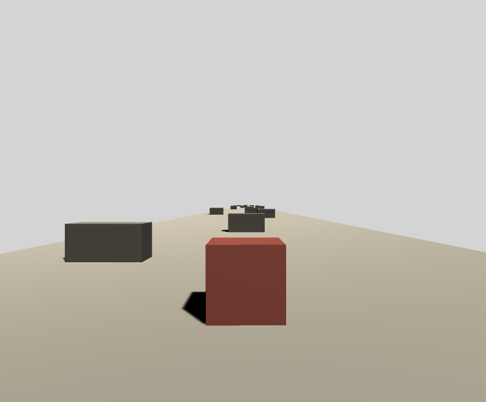

# unity3dpractice

Unity3D practice – Basic Cube Game

This is a very basic cube game that I created, with the help of the tutorial listed below, just so I could get comfortable with Unity3D. The whole point of the game is to avoid the obstacles.

## Following this tutorial
* https://www.youtube.com/playlist?list=PLPV2KyIb3jR5QFsefuO2RlAgWEz6EvVi6

## Dependencies
Unity 2020.1.8f1

## How it works
* Avoid the obstacles
* To move right, press the letter "d"
* To move left, press the letter "a"
